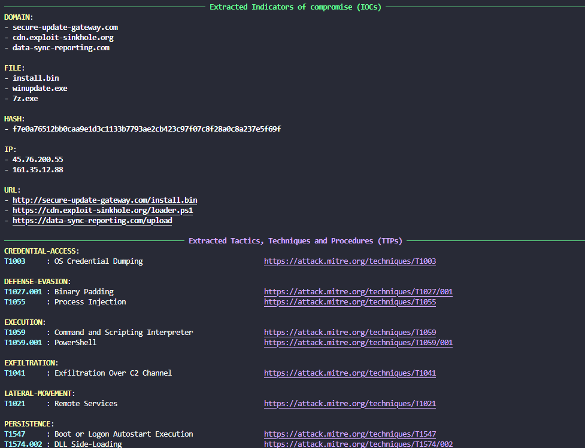

# Threat Parser

Threat Parser is a simple Python tool to extract Indicators of Compromise (IOCs) and Tactics, Techniques, and Procedures (TTPs) from threat intelligence reports.

## Features

- Extracts IOCs (such as IPs, domains, hashes) from text files.
- Extracts TTPs using MITRE ATT&CK mappings.
- Outputs results in a readable format using [Rich](https://github.com/Textualize/rich).

## Project Structure

```
main.py
parser.py
export.py
data/
    enterprise-attack.json
extractors/
    ioc_extractor.py
    ttp_extractor.py
samples/
    report.txt
    report2.txt
```

## Requirements

- Python 3.10+
- [python-dotenv](https://pypi.org/project/python-dotenv/)
- [rich](https://pypi.org/project/rich/)
- [mitreattack-python](https://github.com/mitre-attack/mitreattack-python/tree/master)
- [tldextract](https://pypi.org/project/tldextract/)

Install dependencies:
```sh
pip install rich mitreattack-python tldextract python-dotenv
```

## Usage

Run the parser on a sample report:
```sh
python main.py -f samples/report.txt
```

- Use `-f` or `--file` to specify the path to your report file.
- Use `-n` or `--no-lookup` to disable VirusTotal hash lookups.
- Use `-o` or `--output` to specify an output file for the extracted IOCs and TTPs.

> [!NOTE]
> For now, only csv output is supported.

To send found hashes to VirusTotal, set the `VT_API_KEY` in a `.env` file:
```
VT_API_KEY=your_virustotal_api_key
```

> [!NOTE]
> The VirusTotal API key is optional. If not provided, hash lookups will be skipped.

## How it Works

- [`main.py`](main.py) is the entry point. It parses arguments and prints extracted IOCs and TTPs.
- [`parser.py`](parser.py) defines the [`ThreatReportParser`](parser.py) class, which loads the report and delegates extraction to:
  - [`extractors/ioc_extractor.py`](extractors/ioc_extractor.py) for IOCs
  - [`extractors/ttp_extractor.py`](extractors/ttp_extractor.py) for TTPs

## Sample Output



## License

MIT License

See python library licenses under the [LICENSES](LICENSES) directory